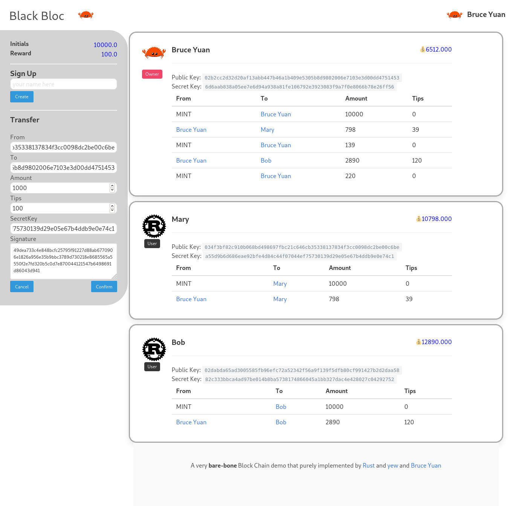

# Intro

bloc is one of **bare-bone** blockchain demo written by [Rust](https://rust-lang.org), Web-Assmebly during my learning BlockChain, about years ago.

see demo [here](https://homelyguy.github.io/bloc)

It just demonstrate the essentials of a blockchain, including User and Transaction manipulation. 
The underlaying layer of the blockchain adopts some common algorithms e.g `elliptic curve: y^2 = x^3 + 7`,  `Sha256` hash and etc.

# How to Use 

- Install [trunk](https://trunkrs.dev)
- run `trunk serve` to preview

**Note that** It is just a simple demo and **NOT FOR PRODUCTION**
